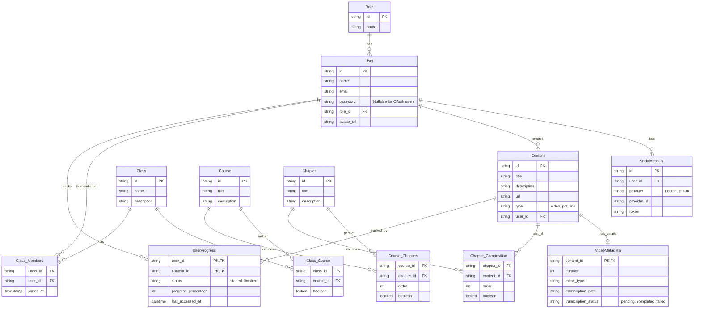

```mermaid
erDiagram
  %% --- Authentication & Users ---
  User ||--o{ SocialAccount : has
  Role ||--o{ User : has
  
  User {
    string id PK
    string name
    string email
    string password "Nullable for OAuth users"
    string role_id FK
    string avatar_url
  }
  Role {
    string id PK
    string name
  }
  SocialAccount {
    string id PK
    string user_id FK
    string provider "google, github"
    string provider_id
    string token
  }

  %% --- Content Management ---
  User ||--o{ Content : creates
  Content ||--o| VideoMetadata : has_details
  
  Content {
    string id PK
    string title
    string description
    string url
    string type "video, pdf, link"
    string user_id FK
  }
  
  VideoMetadata {
    string content_id PK, FK
    int duration
    string mime_type
    string transcription_path
    string transcription_status "pending, completed, failed"
  }

  %% --- Structure (Class > Course > Chapter) ---
  "Class" ||--o{ Class_Course : includes
  Course ||--o{ Class_Course : part_of
  "Class" ||--o{ Class_Members : has
  User ||--o{ Class_Members : is_member_of
  
  "Class" {
    string id PK
    string name
    string description
  }
  Class_Members {
    string class_id FK
    string user_id FK
    timestamp joined_at
  }
  Class_Course {
    string class_id FK
    string course_id FK
    locked boolean
  }

  Course ||--o{ Course_Chapters : includes
  Course {
    string id PK
    string title
    string description
  }
  Course_Chapters {
    string course_id FK
    string chapter_id FK
    int order
    locaked boolean
  }

  Chapter ||--o{ Course_Chapters : part_of
  Chapter ||--o{ Chapter_Composition : contains
  Chapter {
    string id PK
    string title
    string description
  }
  
  Content ||--o{ Chapter_Composition : part_of
  Chapter_Composition {
    string chapter_id FK
    string content_id FK
    int order
    locked boolean
  }

  %% --- Student Progress ---
  User ||--o{ UserProgress : tracks
  Content ||--o{ UserProgress : tracked_by
  UserProgress {
    string user_id PK, FK
    string content_id PK, FK
    string status "started, finished"
    int progress_percentage
    datetime last_accessed_at
  }
```